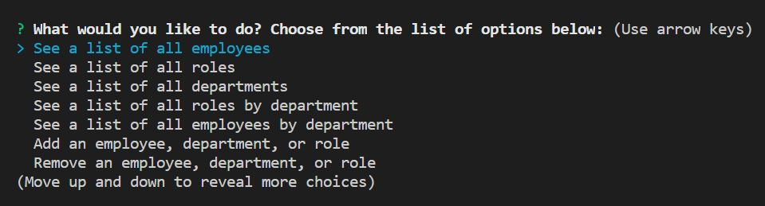
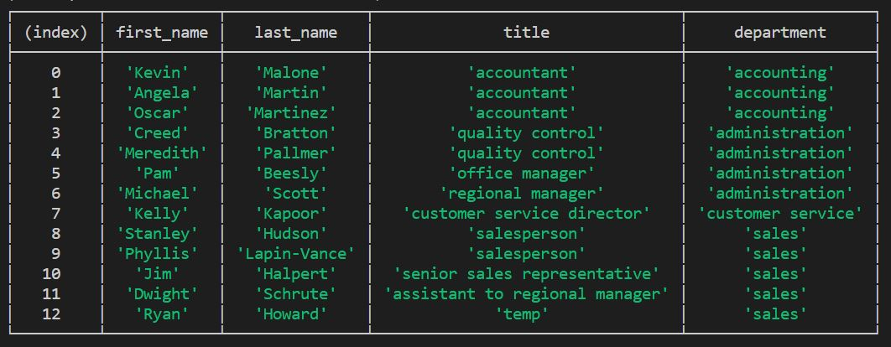

# Team-Manager

  ## Description 
  A team manager tool, compatible with a mySQL database

  ## Table of Contents
  * [Installation](#installation)

  * [Usage](#usage)
  
  * [License](#license)
  
  * [Contributing](#contributing)
  
  * [Questions](#questions)

  ## Installation
  To install: 
  install node.js and download Team-Manager. Use the schema and seed data to run.  

  ## Usage 
  run "node index.js" in the terminal, and choose from the various options to see all team members, and add or remove employees, roles or departments.
   

   Various table are displayed depending on the selection.  Below is the list of all employees by department: 
   

  ## License
  The Unlicense

  ## Contributing 

  All are welcome to contribute to this project.

  ## Questions

  If you have any questions, run into any issues, or just want to chat with me, Carl, you can reach me at koepkecj@gmail.com.  Check out more of my work here: [Carl-33](https://github.com/Carl-33/).